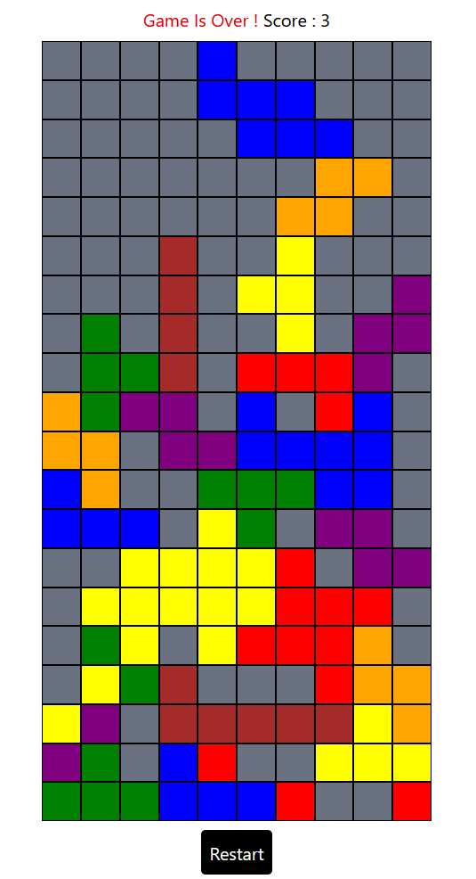

#### A little game to experiment tetris game development

Here is an image of the result

To play the game : 

- ArrowLeft to move a block to the left
- ArrowRight to move a block to the right
- Space button to rotate a block
- The score is the number of full lines made during a game

